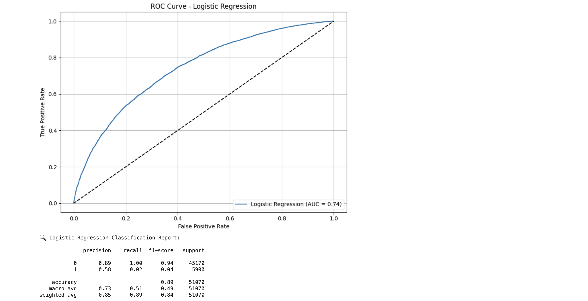
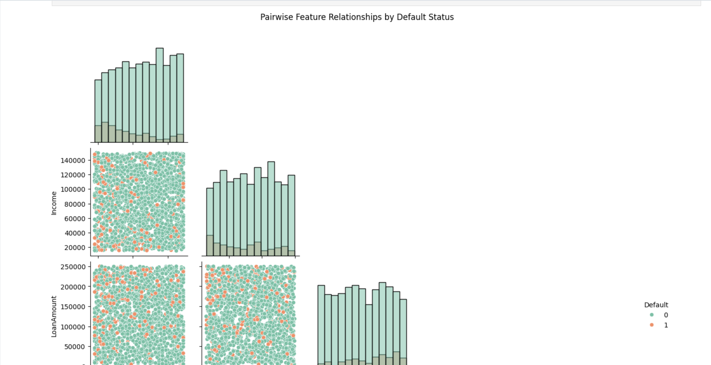
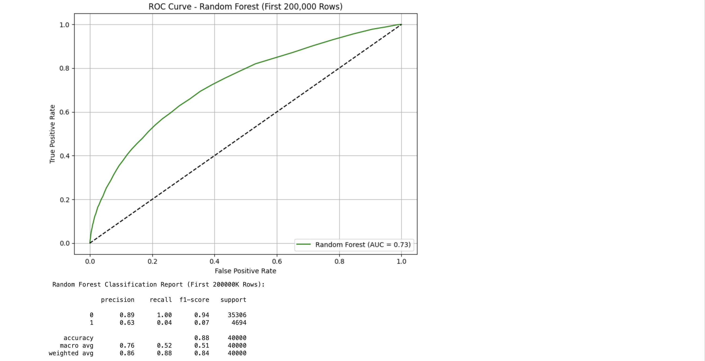

# DebtRiskIQ: Loan Default Prediction & Credit Risk Analytics

## Project Overview

DebtRiskIQ is a machine learning project designed to predict loan default risk using borrower financial and demographic characteristics. The project applies predictive analytics techniques to identify high-risk borrowers, improve lending decisions, and demonstrate how data science can be leveraged within the financial services industry.

The solution combines exploratory data analysis (EDA), feature engineering, classification modeling, and performance evaluation to create a practical framework for credit risk assessment.

---

## Business Problem

Financial institutions face significant losses from borrower defaults. Traditional manual review processes can be time-consuming and may overlook hidden risk patterns within large datasets.

This project addresses the challenge by developing predictive models capable of identifying borrowers with elevated default risk before loan approval, enabling more informed lending decisions and improved portfolio management.

---

## Project Objectives

* Analyze borrower characteristics and loan repayment behavior.
* Identify relationships between financial variables and default outcomes.
* Develop predictive models capable of classifying default risk.
* Compare machine learning approaches for credit risk prediction.
* Evaluate model performance using ROC analysis and classification metrics.
* Demonstrate practical applications of AI in financial services.

---

## Dataset

The dataset contains borrower financial and demographic information commonly used in loan underwriting and risk assessment.

Example features include:

* Loan Amount
* Income
* Employment Status
* Debt-to-Income Ratio
* Credit History Indicators
* Loan Purpose
* Default Status

The target variable is whether a borrower ultimately defaulted on the loan.

---

## Methodology

### 1. Data Preparation

* Data cleaning
* Missing value handling
* Feature selection
* Encoding categorical variables
* Train-test split

### 2. Exploratory Data Analysis (EDA)

* Distribution analysis
* Correlation exploration
* Feature relationship visualization
* Borrower segmentation

### 3. Machine Learning Models

#### Logistic Regression

A baseline classification model used to estimate default probability and provide interpretable risk predictions.

#### Random Forest Classifier

An ensemble learning model used to capture nonlinear relationships and improve classification performance.

### 4. Model Evaluation

Performance was assessed using:

* ROC Curves
* Classification Metrics
* Model Comparison Analysis
* Predictive Accuracy Assessment

---

## Technologies Used

* Python
* Pandas
* NumPy
* Matplotlib
* Seaborn
* Scikit-Learn
* Jupyter Notebook

---

## Key Findings

* Borrower characteristics exhibit measurable relationships with default behavior.
* Feature interaction analysis reveals important indicators of credit risk.
* Logistic Regression provides interpretable risk predictions.
* Random Forest improves the ability to capture complex relationships between borrower attributes.
* ROC analysis demonstrates the predictive effectiveness of both approaches.

---

## Project Workflow

Data Collection
↓
Data Cleaning & Preparation
↓
Exploratory Data Analysis
↓
Feature Engineering
↓
Logistic Regression Modeling
↓
Random Forest Modeling
↓
Performance Evaluation
↓
Credit Risk Insights & Recommendations

---

# Visualizations

## Feature Relationship Analysis



This exploratory analysis visualizes relationships among borrower features and highlights patterns associated with loan repayment behavior and default risk.

---

## Logistic Regression ROC Curve



The ROC curve evaluates the performance of the Logistic Regression model in distinguishing between default and non-default loan outcomes.

---

## Random Forest ROC Curve



The Random Forest classifier demonstrates predictive capability through ROC analysis and provides performance comparisons against Logistic Regression.

---

## Project Branding


DebtRiskIQ project branding and repository identity.

---

## Results & Impact

This project demonstrates how machine learning can support financial institutions by:

* Improving loan approval decisions.
* Identifying high-risk borrowers.
* Reducing potential default losses.
* Enhancing portfolio risk management.
* Supporting data-driven lending strategies.

The framework can be expanded into production-grade credit scoring systems and integrated into financial decision support platforms.

---

## Future Improvements

Potential enhancements include:

* XGBoost implementation
* LightGBM implementation
* Hyperparameter optimization
* Explainable AI (SHAP)
* Real-time risk scoring
* Streamlit deployment
* Automated reporting dashboards

---

## Repository Structure

```text
DebtRiskIQ/
│
├── notebook/
│   └── DebtRiskIQ.ipynb
│
├── visuals/
│   ├── FeatureRelationshipsEDA.png
│   ├── LogisticRegressionROC.png
│   ├── DebtRiskIQ_RandomForestROC.png
│   └── loan_logo.png
│
├── data/
│
├── README.md
├── requirements.txt
└── .gitignore
```

## Installation

```bash
git clone https://github.com/Dare215/DebtRiskIQ.git
cd DebtRiskIQ
pip install -r requirements.txt
```

## Usage

Launch Jupyter Notebook:

```bash
jupyter notebook
```

Open:

```text
notebook/DebtRiskIQ.ipynb
```

Run all cells to reproduce:

* Data preprocessing
* Exploratory analysis
* Logistic Regression model
* Random Forest model
* ROC performance evaluation

---

# Author

**Darious Brown**
PhD Candidate – Artificial Intelligence & Machine Learning Specialization
Walsh College

GitHub: https://github.com/Dare215

LinkedIn: https://www.linkedin.com/in/dariousbrown

Portfolio: https://dare215.github.io/DariousBrown-Portfolio/

Email: [dariousbrown3@icloud.com](mailto:dariousbrown3@icloud.com)

---

## Research Interests

* Artificial Intelligence
* Machine Learning
* Deep Learning
* Predictive Analytics
* Financial Risk Modeling
* Generative AI
* Pharmaceutical Manufacturing Analytics
* Process Optimization

---

## About This Portfolio

This repository is part of a larger Artificial Intelligence and Data Science portfolio showcasing machine learning, deep learning, predictive analytics, natural language processing, generative AI, computer vision, forecasting, and business intelligence projects developed throughout graduate and doctoral studies.
